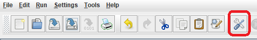
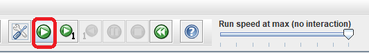
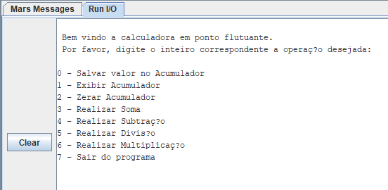

# Microprocessadores-MIPS

Repositório de atividades realizadas em 2020, durante a disciplina de Microprocessadores. Resolvi deixar registrado essas atividades, 
guardo com carinho porque elas também são o "marco zero" do meu interesse por aprofundar meus estudos em Computação. 

Neste repositorio você vai encontrar estes dois programas em Assembly-MIPS 
que foram desenvolvidos no [Simulador MARS](http://courses.missouristate.edu/kenvollmar/mars/):

- [Jogo Genius](#jogoGenius)

- [Calculadora em Ponto Flutuante](#calculadora)

# Jogo Genius

## Como rodar o Jogo

- [Configurar Ambiente](#configuracao)

- Com o simulador aberto:

    - abrir arquivo desse repositorio 

    - configurar bitmap display

    - rodar arquivo

## Como Jogar

[Voltar ao Topo da Pagina](#topo)

# Calculadora em Ponto Flutuante

- [Configurar Ambiente](#configuracao)

## Como rodar a Calculadora

1. Abrir o arquivo "Calculadora.asm" no simulador MARS

2. Salvar aquivo

3. No menu superior clique no icone das chaves para "preparar" para rodar

4. Clicar no icone "Run" 

5. O menu da calculadora será exibido na aba "Run I/O" do simulador

[Voltar ao Topo da Pagina](#topo)

## Configurar Ambiente

- É necessário ter Java instalado para rodar o Simulador MARS 
    - Você pode baixar, se não tiver, o Java no [link](https://www.java.com/pt-BR/download/manual.jsp)

- Baixar Simulador MARS: [link para dowload](https://courses.missouristate.edu/KenVollmar/mars/download.htm)

[Voltar ao Topo da Pagina](#topo)
